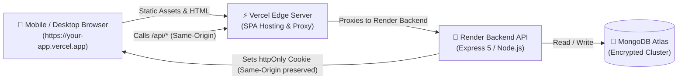

<div align="center">

# ⚡ TaskFlow

**A modern, production-ready Full-Stack MERN Task & Productivity Manager with PWA capabilities, Kanban Board, Natural Language Quick-Add, and Focus Timer.**

[](https://nodejs.org/)
[](https://react.dev/)
[](https://expressjs.com/)
[](https://www.mongodb.com/)
[](https://vitejs.dev/)
[](#-pwa--mobile-installation)
[](LICENSE)

[Live Demo](#-production-deployment) • [Features](#-key-features) • [Architecture](#-architecture--security-model) • [Getting Started](#-getting-started) • [API Docs](#-api-endpoints)

</div>

---

## 📖 Overview

**TaskFlow** is engineered to eliminate task fatigue. Combining high-performance modern web standards with privacy-first architecture, it offers a seamless cross-platform experience across Desktop and Mobile devices without requiring native App Store distribution.

---

## ✨ Key Features

### 📋 Task Management & Productivity
- **Dynamic Views**: Seamlessly switch between List, Detailed Cards, and Drag-and-Drop **Kanban Board**.
- **Natural Language Quick-Add**: Intuitive shorthand parser (e.g., `Pay rent tomorrow 5pm !high #bills every month`).
- **Recurring Tasks**: Automatic regeneration on completion (daily, weekly, monthly, yearly).
- **Subtask Checklists**: Interactive subtask progress tracking.
- **Organization**: Tag labels, custom color highlights, priority levels (`low`, `medium`, `high`, `urgent`), and task pinning.
- **Trash & Archive Lifecycle**: 30-day soft-delete trash buffer with one-click restore and bulk operations.

### ⏱️ Focus & Time Tracking
- **Integrated Pomodoro / Focus Timer**: Track active minutes dedicated to individual tasks.
- **Dashboard Analytics**: Real-time streaks, overdue alerts, completion velocity donuts, and focus metrics.
- **Command Palette (`Ctrl+K` / `Cmd+K`)**: Rapid global keyboard navigation and shortcut actions.

### 📱 Progressive Web App (PWA)
- **Installable Everywhere**: One-click install on Android, iOS Safari, Windows, macOS, and ChromeOS.
- **Native-Like UI**: Standalone window, notch / dynamic-island safe area padding, splash screen, and responsive shell caching via Service Worker.
- **Home Screen Shortcuts**: Jump directly to *New Task* or *Vital Tasks* from your launcher.

### 🛡️ Enterprise-Grade Security
- **Strict Cookie Authentication**: JWT stored inside encrypted `httpOnly`, `SameSite=lax` cookies (immune to XSS token theft).
- **CSRF & Origin Guard**: Rejection of unverified cross-site state mutations.
- **Rate Limiting & Hardened Headers**: Powered by `express-rate-limit` and `helmet` with custom proxy trust calibration.

---

## 🏛️ Architecture & Security Model

TaskFlow solves the dreaded third-party cookie restrictions enforced by iOS Safari (ITP) and modern browsers by utilizing a **Reverse Proxy Architecture**:



> **Why this matters**: Because Vercel proxies requests sent to `/api` directly to Render behind the scenes, the browser treats both the UI and the API as the exact same domain. Cookies are never blocked or dropped by strict mobile browsers.

---

## 🛠️ Tech Stack

| Layer | Technologies |
|---|---|
| **Frontend** | React 19, Vite 6, React Router 7, Lucide Icons, Pure CSS Modules |
| **Backend** | Node.js 20+, Express 5, Mongoose 9, Zod, Morgan, Compression |
| **Authentication** | JSON Web Tokens (JWT), Bcrypt.js, HttpOnly Secure Cookies |
| **Database** | MongoDB Atlas with Mongoose schema validation |
| **PWA Engine** | Web App Manifest, Cache-First Shell Service Worker |
| **Testing** | Vitest, React Testing Library, JSDOM, Smoke Integration Tests |
| **Hosting** | Vercel (Frontend + Proxy), Render (Backend API), MongoDB Atlas |

---

## 🚀 Getting Started

### 📋 Prerequisites
- **Node.js**: `v20.0.0` or higher ([Download](https://nodejs.org/))
- **npm**: `v9.0.0` or higher
- **MongoDB**: Local MongoDB instance or free [MongoDB Atlas Cluster](https://www.mongodb.com/cloud/atlas)

---

### 1️⃣ Clone & Configure Environment

```bash
# Clone the repository
git clone https://github.com/<your-username>/<your-repo-name>.git
cd <your-repo-name>
```

#### Backend Setup:
```bash
cd backend
cp .env.example .env
```
Edit `backend/.env` with your credentials:
```env
NODE_ENV=development
PORT=5001
MONGODB_URI=mongodb+srv://<username>:<password>@cluster.mongodb.net
DB_NAME=taskflow
JWT_SECRET=super_secret_random_key_min_32_characters
JWT_EXPIRES_DAYS=7
CLIENT_ORIGIN=http://localhost:5173
COOKIE_SAMESITE=lax
TRUST_PROXY=1
```

---

### 2️⃣ Install Dependencies

```bash
# In backend directory
npm install

# In frontend directory
cd ../frontend
npm install
```

---

### 3️⃣ Run in Development Mode

Open two terminal windows:

#### Terminal 1: Backend
```bash
cd backend
npm run dev
# Starts API at http://localhost:5001
```

#### Terminal 2: Frontend
```bash
cd frontend
npm run dev
# Starts UI at http://localhost:5173
```

> **Local Network Testing (Phone on same Wi-Fi)**:
> Run frontend with `npm run dev -- --host` and add your local IP (e.g., `http://192.168.1.50:5173`) to `CLIENT_ORIGIN` in `backend/.env`.

---

## 📡 API Endpoints

All endpoints are mounted under `/api`.

### 🔐 Authentication
| Method | Endpoint | Description | Auth Required |
|---|---|---|---|
| `POST` | `/api/auth/register` | Create account & set auth cookie | No |
| `POST` | `/api/auth/login` | Authenticate & set auth cookie | No |
| `POST` | `/api/auth/logout` | Clear auth cookie | Yes |
| `GET` | `/api/auth/me` | Fetch active user session | Yes |
| `PATCH` | `/api/auth/me` | Update profile information | Yes |

### 📝 Tasks Management
| Method | Endpoint | Description |
|---|---|---|
| `GET` | `/api/tasks` | Get tasks (`?view=active\|archived\|trash`, `&search=`, `&sort=`) |
| `POST` | `/api/tasks` | Create new task |
| `PATCH` | `/api/tasks/:id` | Update task details |
| `DELETE` | `/api/tasks/:id` | Soft-delete task (move to trash) |
| `POST` | `/api/tasks/:id/restore`| Restore task from trash/archive |
| `POST` | `/api/tasks/:id/focus` | Increment recorded focus minutes |
| `DELETE` | `/api/tasks/:id/permanent` | Permanently remove individual task |
| `DELETE` | `/api/tasks/trash` | Purge entire trash directory |
| `POST` | `/api/tasks/bulk` | Batch status update, trash, or restore |
| `GET` | `/api/tasks/stats` | Velocity, overdue, and focus analytics |

---

## 🌐 Production Deployment

### Step 1: Deploy Backend to [Render.com](https://render.com)
1. Create a **New Web Service** and link your GitHub repository.
2. Configure settings:
   - **Root Directory**: `backend`
   - **Build Command**: `npm install`
   - **Start Command**: `npm start`
3. Add Environment Variables:
   - `NODE_ENV`: `production`
   - `MONGODB_URI`: *Your MongoDB connection string*
   - `DB_NAME`: `taskflow`
   - `JWT_SECRET`: *Strong random 64-char key*
   - `CLIENT_ORIGIN`: `https://<your-app>.vercel.app`
   - `TRUST_PROXY`: `2`
4. In **MongoDB Atlas**: Navigate to **Network Access** > Click **Add IP Address** > Select **Allow Access From Anywhere (`0.0.0.0/0`)**.
5. Save and copy your Render URL: `https://your-backend.onrender.com`.

---

### Step 2: Configure & Deploy Frontend to [Vercel.com](https://vercel.com)
1. In `frontend/vercel.json`, replace `YOUR-BACKEND.onrender.com` with your actual Render URL:
   ```json
   {
     "rewrites": [
       { "source": "/api/:path*", "destination": "https://your-backend.onrender.com/api/:path*" },
       { "source": "/((?!api/|assets/|icons/).*)", "destination": "/index.html" }
     ]
   }
   ```
2. Commit and push the changes to GitHub.
3. In [Vercel Dashboard](https://vercel.com), click **Add New** > **Project** and import your repository.
4. Set **Root Directory** to `frontend`.
5. Leave Build Settings as default (Framework: Vite). Click **Deploy**.
6. Update `CLIENT_ORIGIN` in Render with your live Vercel URL.

---

## 📱 PWA & Mobile Installation

Once deployed to HTTPS via Vercel:

<details>
<summary><b>🤖 Android (Google Chrome)</b></summary>

1. Open your live Vercel URL in Chrome.
2. Tap the menu button (`⋮`) in the top-right corner.
3. Select **Install app** (or **Add to Home screen**).
4. TaskFlow will appear in your app drawer and home screen.
</details>

<details>
<summary><b>🍎 iOS (Safari)</b></summary>

1. Open your live Vercel URL in Safari.
2. Tap the **Share** button (`⎙` / square with arrow) at the bottom.
3. Scroll down and tap **Add to Home Screen**.
4. Confirm by tapping **Add** in the top-right corner.
</details>

<details>
<summary><b>💻 Desktop (Chrome / Edge / Brave)</b></summary>

1. Visit your app in Chrome or Edge.
2. Click the **Install TaskFlow** button inside the right side of the address bar.
3. The app opens in its own native, distraction-free desktop window.
</details>

---

## 🧪 Testing & Verification

```bash
# Run Frontend Unit Tests (Parser, Utilities)
cd frontend
npm test

# Run ESLint Static Analysis
npm run lint

# Compile Production Frontend Bundle
npm run build

# Run Backend Syntax Check
cd ../backend
npm run test:api
```

---

## 📂 Project Directory Structure

```text
MERN-taskflow/
├── backend/
│   ├── src/
│   │   ├── middleware/     # Auth, error, rate-limit & CORS guards
│   │   ├── models/         # Mongoose schemas (User, Task)
│   │   ├── routes/         # Express endpoint definitions
│   │   ├── app.js          # App instance & middleware configuration
│   │   ├── config.js       # Typed environment validation
│   │   └── server.js       # HTTP server boot & graceful shutdown
│   ├── tests/              # Smoke & integration tests
│   └── package.json
├── frontend/
│   ├── public/             # PWA Webmanifest, Service Worker & App Icons
│   ├── src/
│   │   ├── components/     # Modals, Kanban, Cards, Timers, Layout
│   │   ├── context/        # Auth, Tasks, Focus State providers
│   │   ├── lib/            # Natural language parser, API client
│   │   └── pages/          # Dashboard, Auth, Tasks, 404
│   ├── vercel.json         # Reverse proxy rewrite rules
│   ├── vite.config.js
│   └── package.json
└── README.md
```

---

## 📄 License

This project is licensed under the [MIT License](LICENSE). Feel free to use, modify, and distribute.
