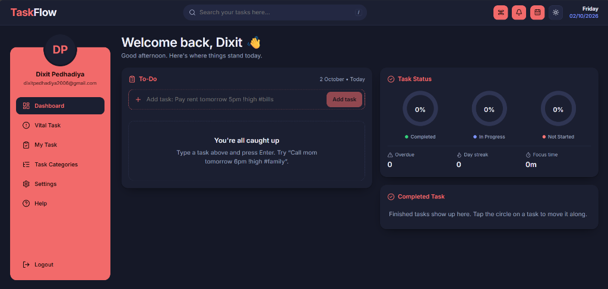

<div align="center">

# ⚡ TaskFlow

**A modern, production-grade MERN Task & Productivity Manager featuring PWA capabilities, Kanban Board, Natural Language Quick-Add, and Pomodoro Focus Timer.**

[](https://nodejs.org/)
[](https://react.dev/)
[](https://expressjs.com/)
[](https://www.mongodb.com/)
[](https://vitejs.dev/)
[](#-pwa--mobile-support)
[](LICENSE)

[Features](#-key-features) • [Tech Stack](#-tech-stack) • [Quick Start](#-quick-start) • [API Reference](#-api-reference) • [PWA Guide](#-pwa--mobile-support)

<br />

<p align="center">
  
</p>

</div>

---

## 📖 Overview

**TaskFlow** is an intuitive, privacy-first task and productivity management application built with the **MERN** stack (MongoDB, Express, React, Node.js). Designed to deliver a distraction-free workflow, TaskFlow brings desktop-class speed, natural language parsing, and mobile-friendly PWA installation without requiring app store downloads.

---

## ✨ Key Features

### 📋 Smart Task Management
- **Multiple Workspace Views**: Switch between dynamic List view, Card layout, and an interactive **Kanban Board** with drag-and-drop mechanics.
- **Natural Language Quick-Add**: Add tasks at lightning speed using plain English syntax:
  > `Pay electricity bill tomorrow 5pm !high #utilities every month`
- **Repeating / Recurring Tasks**: Automatically regenerate tasks upon completion (daily, weekly, monthly, yearly).
- **Subtask Checklists**: Interactive subtask breakdown with real-time completion progress.
- **Organization & Metadata**: Categorized tag labels, custom card accent colors, priority levels (`low`, `medium`, `high`, `urgent`), and task pinning.
- **Soft Delete & Archive Lifecycle**: 30-day soft-delete trash buffer with one-click restore and bulk operations.

### ⏱️ Focus & Time Tracking
- **Integrated Focus / Pomodoro Timer**: Track and log active focused minutes directly attached to individual tasks.
- **Productivity Dashboard**: Visual donuts, overdue alerts, daily streaks, and completion analytics.
- **Command Palette (`Ctrl+K` / `Cmd+K`)**: Rapid keyboard navigation and quick actions from anywhere in the app.
- **Theme Support**: Built-in Dark and Light modes with automatic system preference detection.

### 📱 Progressive Web App (PWA)
- **Installable Cross-Platform**: Install as a standalone native-like app on Android, iOS (Safari), Windows, and macOS.
- **App Shell Caching**: Powered by a lightweight Service Worker for instant load times.
- **Device-Optimized**: Native safe-area padding for modern bezel-less and notched mobile screens.
- **Quick Shortcuts**: Launch directly into *New Task* or *Vital Tasks* from your home screen.

### 🔒 Privacy & Security First
- **Secure Cookie Auth**: JWT tokens stored exclusively in `httpOnly`, `SameSite=lax` cookies to mitigate XSS vulnerability risks.
- **Strict Origin & CSRF Guard**: Verified origin validation prevents unauthorized cross-site requests.
- **Hardened Server**: Protected with Helmet security headers, compression, and request rate limiting.

---

## 🛠️ Tech Stack

| Layer | Technologies |
|---|---|
| **Frontend** | React 19, Vite, React Router, Lucide Icons, Pure CSS Modules |
| **Backend** | Node.js (v20+), Express 5, Mongoose 9, Zod Validation, Morgan, Compression |
| **Authentication** | JSON Web Tokens (JWT), Bcrypt.js, HttpOnly Secure Cookies |
| **Database** | MongoDB with strict Schema validation & indexing |
| **PWA & Offline** | Web App Manifest, Cache-First Shell Service Worker |
| **Testing** | Vitest, React Testing Library, JSDOM |

---

## 🚀 Quick Start

### 📋 Prerequisites
- **Node.js**: `v20.0.0` or higher ([Download](https://nodejs.org/))
- **MongoDB**: Local MongoDB instance or free [MongoDB Atlas Cluster](https://www.mongodb.com/cloud/atlas)

---

### 1️⃣ Installation

```bash
# Clone the repository
git clone https://github.com/<your-username>/<your-repo-name>.git
cd <your-repo-name>

# Install Backend dependencies
cd backend
npm install

# Install Frontend dependencies
cd ../frontend
npm install
```

---

### 2️⃣ Environment Configuration

Create a `.env` file inside the `backend/` directory by copying `.env.example`:

```bash
cd backend
cp .env.example .env
```

Configure your local environment variables:

```env
NODE_ENV=development
PORT=5001
MONGODB_URI=mongodb+srv://<username>:<password>@cluster.mongodb.net
DB_NAME=taskflow
JWT_SECRET=your_super_secret_random_key_here
JWT_EXPIRES_DAYS=7
CLIENT_ORIGIN=http://localhost:5173
COOKIE_SAMESITE=lax
TRUST_PROXY=1
```

> **Note**: Sensitive `.env` files are strictly ignored by `.gitignore` and are never committed to version control.

---

### 3️⃣ Running the Application

Open two terminal windows:

#### Terminal 1 — Backend API
```bash
cd backend
npm run dev
# Server running at http://localhost:5001
```

#### Terminal 2 — Frontend Client
```bash
cd frontend
npm run dev
# Client running at http://localhost:5173
```

---

## 📡 API Reference

All API routes are prefixed under `/api`.

### 🔐 Authentication (`/api/auth`)
| Method | Route | Description | Auth Required |
|---|---|---|---|
| `POST` | `/api/auth/register` | Register new account & set auth cookie | No |
| `POST` | `/api/auth/login` | Authenticate user & set auth cookie | No |
| `POST` | `/api/auth/logout` | Clear session cookie | Yes |
| `GET` | `/api/auth/me` | Get current authenticated user | Yes |
| `PATCH` | `/api/auth/me` | Update user profile | Yes |

### 📝 Tasks Management (`/api/tasks`)
| Method | Route | Description | Auth Required |
|---|---|---|---|
| `GET` | `/api/tasks` | Fetch tasks (`?view=active\|archived\|trash`, `&search=`, `&sort=`) | Yes |
| `POST` | `/api/tasks` | Create new task | Yes |
| `PATCH` | `/api/tasks/:id` | Update task details | Yes |
| `DELETE` | `/api/tasks/:id` | Move task to trash | Yes |
| `POST` | `/api/tasks/:id/restore` | Restore task from trash / archive | Yes |
| `POST` | `/api/tasks/:id/focus` | Increment recorded focus minutes | Yes |
| `DELETE` | `/api/tasks/:id/permanent` | Permanently delete task | Yes |
| `DELETE` | `/api/tasks/trash` | Empty trash | Yes |
| `POST` | `/api/tasks/bulk` | Batch status update, trash, or restore | Yes |
| `GET` | `/api/tasks/stats` | Retrieve productivity stats & focus analytics | Yes |

---

## 📱 PWA & Mobile Support

TaskFlow is configured as a fully installable **Progressive Web App**:

- **Android (Chrome)**: Tap the browser menu (`⋮`) and select **"Install app"** or **"Add to Home screen"**.
- **iOS (Safari)**: Tap the **Share** button (`⎙`) and select **"Add to Home Screen"**.
- **Desktop (Chrome / Edge)**: Click the **Install** icon in the browser address bar.

---

## 🧪 Testing & Verification

```bash
# Run Frontend Unit Tests
cd frontend
npm test

# Run ESLint Static Analysis
npm run lint

# Compile Production Build
npm run build
```

---

## 📂 Project Structure

```text
├── backend/
│   ├── src/
│   │   ├── middleware/     # Auth guard, error handler, rate limiters
│   │   ├── models/         # Mongoose models (User, Task)
│   │   ├── routes/         # Express API routes
│   │   ├── app.js          # Express app configuration
│   │   ├── config.js       # Environment configuration & validation
│   │   └── server.js       # Server entry point
│   ├── tests/              # API smoke tests
│   └── package.json
├── frontend/
│   ├── public/             # PWA Manifest, Service Worker & Icons
│   ├── src/
│   │   ├── components/     # UI Components (Kanban, Timer, Modals, Cards)
│   │   ├── context/        # React Contexts (Auth, Tasks, Focus, Toast)
│   │   ├── lib/            # Natural language parser, API client
│   │   └── pages/          # Application views (Dashboard, Tasks, Auth)
│   ├── vite.config.js
│   └── package.json
└── README.md
```

---

## 📄 License

This project is open-source and available under the [MIT License](LICENSE).
